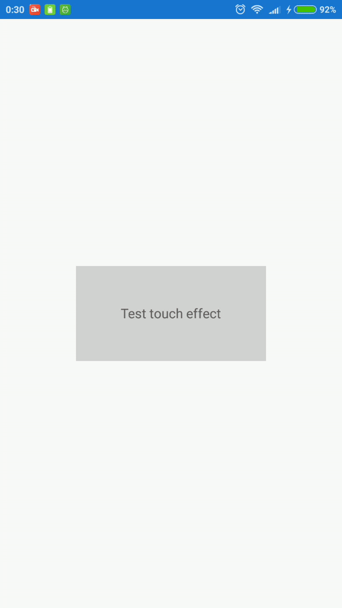
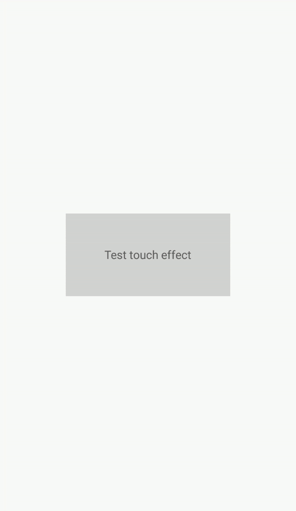

# XamEffects for Xamarin.Forms
[](http://www.nuget.org/packages/XamEffects/)

Xamarin Forms effects for Android and iOS only.

## Install
```bash
Install-Package XamEffects
```
You have to install this nuget package to PCL project and each platform project.

### Minimum requirements
iOS 8+, Android 4.3 (API 18) 

Performance of older versions is not guaranteed.

### Init library

##### iOS
To use by iOS, you need to call Init method in AppDelegate.cs

```csharp
public override bool FinishedLaunching(UIApplication app, NSDictionary options)
{
    global::Xamarin.Forms.Forms.Init();

    XamEffects.iOS.Effects.Init(); //write here

    LoadApplication(new App());
    return base.FinishedLaunching(app, options);
}
```

## TouchEffect

Add touch effect to views.

For Android API >=21 using Ripple effect, for Android API <21 and iOS using animated color selection.

iOS|Android API >=21|Android API <21
------------|------------|------------
||


### Supported Views (in case Xamarin.Forms 2.3.4)

|                 |iOS |Android|
|-----------------|----|-------|
|ActivityIndicator|✅   |✅      |
|BoxView          |✅   |✅      |
|Button           |✅   |✅      |
|DatePicker       |❌   |✅      |
|Editor           |❌   |❌      |
|Entry            |❌   |❌      |
|Image            |✅   |✅      |
|Label            |✅   |✅      |
|ListView         |✅   |❌      |
|Picker           |❌   |✅      |
|ProgressBar      |✅   |✅      |
|SearchBar        |❌   |❌      |
|Slider           |✅   |❌      |
|Stepper          |✅   |❌      |
|Switch           |❌   |✅      |
|TableView        |❌   |❌      |
|TimePicker       |❌   |✅      |
|WebView          |❌   |❌      |
|ContentPresenter |✅   |✅      |
|ContentView      |✅   |✅      |
|Frame            |✅   |❌      |
|ScrollView       |✅   |❌      |
|TemplatedView    |✅   |✅      |
|AbsoluteLayout   |✅   |✅      |
|Grid             |✅   |✅      |
|RelativeLayout   |✅   |✅      |
|StackLayout      |✅   |✅      |

### Parameters

* On
    * Effect On/Off (true is On)
* Color
    * Background/Ripple color when touched. If it doesn't setting, nothing will occur.
    
### Example 

```xml
<ContentPage xmlns="http://xamarin.com/schemas/2014/forms"
             xmlns:x="http://schemas.microsoft.com/winfx/2009/xaml"
             xmlns:local="clr-namespace:XamEffects.Sample"
             xmlns:xe="clr-namespace:XamEffects;assembly=XamEffects"
             x:Class="XamEffects.Sample.MainPage">
    <Grid HorizontalOptions="Center"
          VerticalOptions="Center"
          HeightRequest="100"
          WidthRequest="200"
          BackgroundColor="LightGray" 
          xe:TouchEffect.On="True"
          xe:TouchEffect.Color="Red">
        <Label Text="Test touch effect"
               HorizontalOptions="Center"
               VerticalOptions="Center"/>
    </Grid>
</ContentPage>
```

## License

MIT Licensed.
