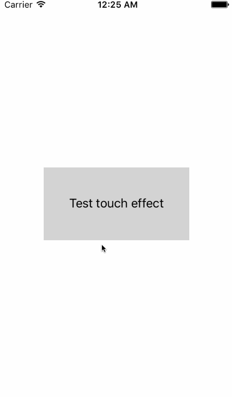
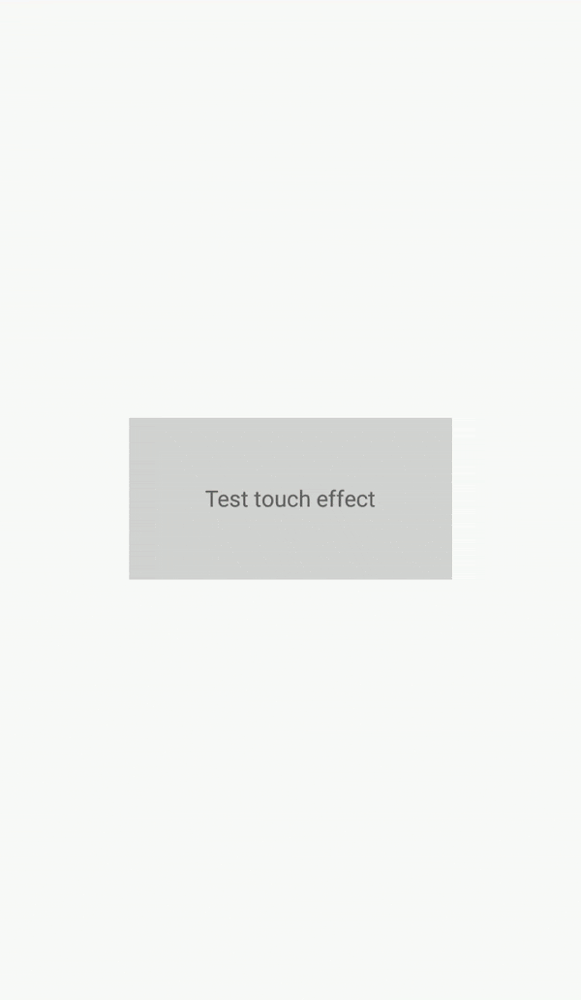

# XamEffects - UI effects for Xamarin.Forms
[](http://www.nuget.org/packages/XamEffects/)

### Setup
```bash
Install-Package XamEffects
```
* You have to install this nuget package to Xamarin.Forms project and each platform project.
* Call after ```Forms.Init(...)```:
    * ```XamEffects.iOS.Effects.Init();``` for iOS AppDelegate in **FinishedLaunching**
    * ```XamEffects.Droid.Effects.Init();``` for Android MainActivity in **OnCreate**

|Platform|Minimum version|
|------------|------------|
|iOS|8|
|Android|4.1 (API 16)|
|Xamarin.Forms|2.5.0|
|.NETStandard|1.0|

### Features
* [TouchEffect](#toucheffect) - Add touch effect to views.
* [Commands](#commands) - Add command to views.
* [BorderView](#borderview) - View with borders, corner radius and clipping to bounds.
* [EffectsConfig](#effectsconfig) - Config for effects.


## TouchEffect
Add touch effect to views.

For Android API >=21 using Ripple effect, for Android API <21 and iOS using animated highlighted view.

|iOS|Android API >=21|Android API <21|
|------------|------------|------------|
||


|Property|Type|Value type|Default|Description|
|------------|------------|------------|------------|------------|
|Color|bindable attached|Color|Color.Default|Front/Ripple color when touched. For deactivate effect set Color.Default value. If color will have alpha channel is 255 effect will change it to ±80.|
    
### Example 
```xml
<ContentPage xmlns="http://xamarin.com/schemas/2014/forms"
             xmlns:x="http://schemas.microsoft.com/winfx/2009/xaml"
             xmlns:local="clr-namespace:XamEffects.Sample"
             xmlns:xe="clr-namespace:XamEffects;assembly=XamEffects"
             x:Class="XamEffects.Sample.MainPage">
    <Grid HorizontalOptions="Center"
          VerticalOptions="Center"
          HeightRequest="100"
          WidthRequest="200"
          BackgroundColor="LightGray" 
          xe:TouchEffect.Color="Red">
        <Label Text="Test touch effect"
               HorizontalOptions="Center"
               VerticalOptions="Center"/>
    </Grid>
</ContentPage>
```

```csharp
TouchEffect.SetColor(view, Color.Red);
```

### Important & known issues
* Effect may not work in views with enabled [Fast Renderers](https://docs.microsoft.com/en-us/xamarin/xamarin-forms/internals/fast-renderers).
* Effect may not work in views with another gestures and effects like Button, Slider, Picker, Entry, Editor etc.
* Effect may not work correctly with standard gestures in Xamarin.Forms. If you need some gestures with touch effect, use not GestureRecognizer, but [Commands](#commands).

If effect doesn't work, try wrap view with ContentView and add effect to wrapper.

## Commands
Add command to views.

|Property|Type|Value type|Default|Description|
|------------|------------|------------|------------|------------|
|Tap|bindable attached|ICommand|null|Tap command|
|TapParameter|bindable attached|object|null|Tap command parameter|
|LongTap|bindable attached|ICommand|null|Long tap command|
|LongTapParameter|bindable attached|object|null|Long tap command parameter|
    
### Example 
```xml
<ContentPage xmlns="http://xamarin.com/schemas/2014/forms"
             xmlns:x="http://schemas.microsoft.com/winfx/2009/xaml"
             xmlns:local="clr-namespace:XamEffects.Sample"
             xmlns:xe="clr-namespace:XamEffects;assembly=XamEffects"
             x:Class="XamEffects.Sample.MainPage">
    <Grid HorizontalOptions="Center"
          VerticalOptions="Center"
          HeightRequest="100"
          WidthRequest="200"
          BackgroundColor="LightGray" 
          xe:Commands.Tap="{Binding TapCommand}"
          xe:Commands.LongTap="{Binding LongTapCommand}">
        <Label Text="Test commands"
               HorizontalOptions="Center"
               VerticalOptions="Center"/>
    </Grid>
</ContentPage>
```

```csharp
Commands.SetTap(view, new Command(() => {
  //do something
}));
Commands.SetTapParameter(view, someObject);
```

## BorderView
View with borders, corner radius and clipping to bounds. View based on ContentView, you can specify child through Content property.

|Property|Type|Value type|Default|Description|
|------------|------------|------------|------------|------------|
|CornerRadius|bindable attached|double|0|Corner radius|
|BorderWidth|bindable attached|double|0|Border width|
|BorderColor|bindable attached|Color|Color.Default|Border color|

### Example 
```xml
<ContentPage xmlns="http://xamarin.com/schemas/2014/forms"
             xmlns:x="http://schemas.microsoft.com/winfx/2009/xaml"
             xmlns:local="clr-namespace:XamEffects.Sample"
             xmlns:xe="clr-namespace:XamEffects;assembly=XamEffects"
             x:Class="XamEffects.Sample.MainPage">
    <xe:BorderView 
          HeightRequest="100"
          WidthRequest="200"
          HorizontalOptions="Center"
          VerticalOptions="Center"
          BackgroundColor="LightGray"
          CornerRadius="15"
          BorderColor="Green"
          BorderWidth="2">
        <Label HorizontalOptions="Center"
               VerticalOptions="Center"
               Text="Some content"/>
    </xe:BorderView>
</ContentPage>
```

Why view, not effect like other features? Firstly I planned to do this. For iOS there are no problems, but for Android for clipping to rounded corners need override DispatchDraw from native view, that isn't possible from effect.

### Important & known issues
* Padding work incorrectly in Android. Use margin in child view.

## EffectsConfig

Configs and helpers for effects.

|Property|Type|Value type|Default|Description|
|------------|------------|------------|------------|------------|
|AutoChildrenInputTransparent|usual static|bool|True|Set ChildrenInputTransparent automatically for views with TouchEffect or Command. If value is True you **DON'T** need manually configure **ChildrenInputTransparent**. |
|ChildrenInputTransparent|bindable attached|bool|False|If you use **TouchEffect** or **Commands** for Layout (Grid, StackLayout, etc.) and EffectsConfig.AutoChildrenInputTransparent is False you have to set this parameter to True otherwise in Android layout's children will overlaps these effects. Also you can set `InputTransparent = True` for each children (EXCEPT views using any effect) manually.|

## License
MIT Licensed.

## To do
Support UWP

### Release notes
Moved to [Release notes](ReleaseNotes.md)
